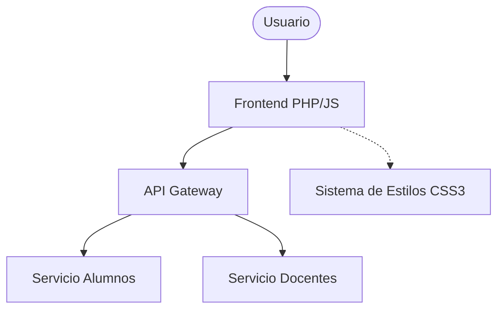

# 🎓 Sistema de Control Escolar

Bienvenido al ecosistema digital de **Gestión de Control Escolar**, una plataforma moderna diseñada para centralizar y optimizar la experiencia académica de alumnos, docentes y administradores.


---

## 🚀 Visión General

Este sistema utiliza una arquitectura basada en **microservicios** y una interfaz de usuario **vibrante y reactiva**, ofreciendo portales especializados para cada rol dentro de la institución.

### 💎 Características Premium
- **Estética Moderna**: Interfaz basada en *Glassmorphism* con gradientes vibrantes y desenfoques elegantes.
- **Carga Dinámica**: Los módulos se cargan mediante la API `fetch`, evitando recargas innecesarias de la página.
- **Responsive**: Adaptado para una visualización óptima en múltiples dispositivos.
- **Arquitectura Escalable**: Separación clara entre el Frontend, el API Gateway y los Servicios.

---

## 🏗️ Arquitectura del Sistema



---

## 📂 Estructura del Proyecto

El repositorio está organizado de forma modular para facilitar el mantenimiento y la escalabilidad:

- **`frontend/`**: El núcleo de la interfaz de usuario.
  - `src/styles/`: Hojas de estilo centralizadas (incluye el sistema de colores vibrantes).
  - `src/modules/`: Componentes dinámicos cargados por demanda.
- **`api-gateway/`**: Gestiona las peticiones entre la interfaz y los servicios internos.
- **`servicio_alumnos/`**: Lógica de negocio y datos específicos para estudiantes.
- **`servicio_docente/`**: Herramientas y gestión de calificaciones para profesores.
- **`docker-compose.yml`**: Orquestación para despliegue en contenedores.

---

## 🛠️ Configuración y Despliegue

### Requisitos Previos
- **Servidor LAMP/WAMP**: Se recomienda **XAMPP** o similar.
- **PHP 7.4+**
- **Servidor Apache** con soporte para reescritura.

### Pasos para la Instalación Local
1. **Clonar**: Descarga el repositorio en tu carpeta de servidor local (ej. `/opt/lampp/htdocs/` o `C:/xampp/htdocs/`).
   ```bash
   git clone [url-del-repositorio] servicio_escolar
   ```
2. **Permisos**: Asegúrate de que el servidor tenga permisos de lectura/escritura en la carpeta.
3. **Acceso**: Abre tu navegador y navega a las siguientes direcciones:

| Portal | URL de Acceso | Descripción |
| :--- | :--- | :--- |
| **Estudiantes** | `http://localhost/servicio_escolar/frontend/` | Consulta de materias y estatus. |
| **Docentes** | `http://localhost/servicio_escolar/frontend/docente.php` | Gestión de clases y notas. |
| **Admin** | `http://localhost/servicio_escolar/frontend/admin.php` | Control total del sistema. |

---

## 🎨 Sistema de Diseño

El sistema utiliza una paleta de colores curada para proporcionar una experiencia visual premium:

- **Primario**: `#6366f1` (Índigo)
- **Secundario**: `#a855f7` (Morado)
- **Acento**: `#0ea5e9` (Cian)
- **Fondo**: Gradientes suaves con efectos de desenfoque (*Blur*).

---

## ⚠️ Notas Importantes para Desarrolladores

> [!IMPORTANT]
> **Case Sensitivity**: En entornos Linux, los nombres de archivos son sensibles a mayúsculas. Asegúrate de que todas las llamadas a módulos en `fetch()` coincidan exactamente con el nombre en el disco (preferiblemente todo en minúsculas).

---

© 2026 Sistema de Control Escolar. Todos los derechos reservados.
